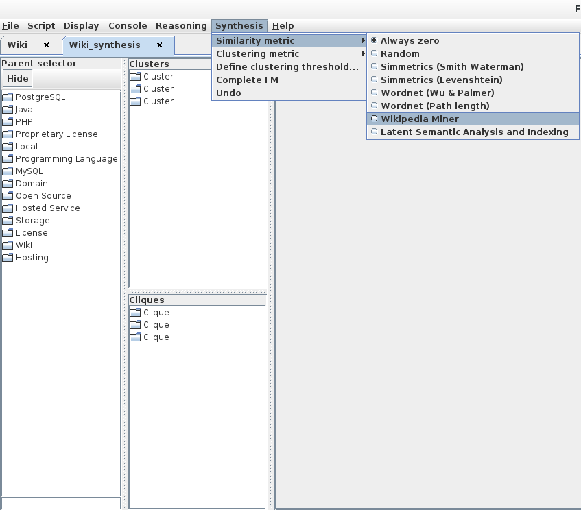
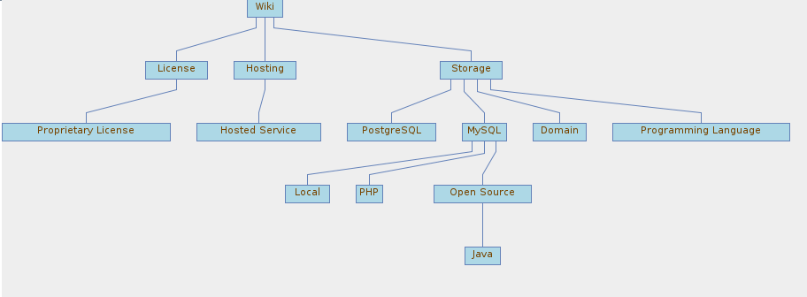

### Breathing Ontological Knowledge Into Feature Model Management

This document presents: 
 * a complete environment we have developed for synthesizing feature models
 * a comprehensive tutorial for using the tool

Important management operations of FAMILIAR, like ksynthesis, slicing, merging, diff, refactoring, are now equiped with ontological capabilities since all are based on the same synthesis procedure.

In particular, we raise previous limitations and open avenues for a practical usage in reverse engineering or maintenance scenarios.
 
``This page is under construction``

##### Authors

 * Guillaume Bécan (University of Rennes 1, Inria / Irisa, Triskell team)
 * Sana Ben Nasr (University of Rennes 1, Inria / Irisa, Triskell team)
 * Mathieu Acher (University of Rennes 1, Inria / Irisa, Triskell team)
 * Benoit Baudry (University of Rennes 1, Inria / Irisa, Triskell team)

#### Motivation

#### Illustrative Examples


#### Features of the Environment

Our tool offers an interactive mode where the user can import a formula (e.g.,
in DIMACS format), synthesizes a complete feature model and export
the result in different formats. During the synthesis, the
GUI displays a ranking list of parent candidates for every
feature, a list of clusters and a graphical preview of the feature model
in construction. During the interactive process, users can:
 * select or ignore a parent candidate in the ranking lists ;
 * select a parent for a cluster within the cluster’s features
or any potential parent feature outside the cluster (the
user can also consider only a subset of a cluster when
selecting the parent) ;
 * undo a previous choice ;
 * define the different heuristics and parameters of the
synthesis ;
 * automatically generate a complete FM according to previous
choices and selected heuristics.

A typical usage is to perform some choices, generate the
current result (through a graphical representation of the feature model)
and reiterate until having a satisfactory model. In particular,
the scenario of an interactive and sound refactoring of a feature model is made possible.

#### Run on the illustrative example


First, we start FAMILIAR and execute the following command:
``` ksynthesis --interactive Wiki ```

This command starts the synthesis environment and the user can see the interface in Figure~\ref{fig:interface_parameters}. 


The next step consists in setting the parameters of the synthesis in the synthesis menu (see Figure~\ref{fig:interface_parameters}). For this example, we choose Wikipedia Miner with the Wikipedia database as the heuristic for parent candidates, Smith-Waterman as the clustering metric and we set the threshold at 0.6. After each change, the parent candidates lists and the clusters are updated.

We start synthesizing the FM by choosing a parent for the feature *Proprietary License*. We open the list of parent candidates for this feature and see that *License* is the best parent according to our heuristic which seems correct (see Figure~\ref{fig:parent_selector}).
.png)
Thus, we right-click on *License* and select the option *Select this parent*. As a result, the features and their new relation appears on the FM overview (see Figure~\ref{fig:parent_selection_effect}).
.png)

We continue our synthesis by choosing a parent for the cluster {PostgreSQL, MySQL}. We know by experience that these features are two types of database and should be siblings. We right-click on the cluster and select the only option available (see Figure~\ref{fig:cluster_selector}).
.png)
A popup window appears asking for the parent of the selected cluster (see Figure~\ref{fig:common_parents_selector}).
.png)
At this point, we can deselect some features that should not be part of this clusters. The list of common parent that appears below is automatically updated and we can choose the parent for this subcluster. In our case we keep all the features selected and we choose Storage as the parent. Once again, the FM is updated and as the two previous choices do not form a single tree, two trees are displayed side by side (see Figure~\ref{fig:cluster_selection_effect}).
.png)

The other available operation on a cluster is to select its parent within the cluster's features. The same operation is available on cliques. We consider the clique {Storage, License, Wiki, Hosting}. This time, to choose *Wiki* as the parent of the clique, we right-click on the feature and select the only option displayed (see Figure~\ref{fig:clique_selector}).
.png)
A popup window appears asking for the children of *Wiki* (see Figure~\ref{fig:children_selector}).
.png)
We confirm the choice and the FM is updated resulting in a single tree (see Figure~\ref{fig:clique_selection_effect}).
.png)

At this point of the synthesis, we start to recognize the hierarchy of the desired FM in Figure~\ref{fig:goodfm}. Thus, we try to generate the rest of the hierarchy by selecting the *Complete FM* option in the synthesis menu (see Figure~\ref{fig:interface_parameters}).

The result in Figure~\ref{fig:generatedFM} is not satisfactory. The heuristics we set at the beginning of the synthesis do not perform well on the other features. For example they propose *Programming Language* as the child of *Storage* instead of *Wiki*. 

In that case, we can change the heuristics and the clustering threshold to influence the automated synthesis or we can continue to provide information by choosing or ignoring a parent in the remaining features. This example illustrates that synthesizing a FM is an iterative process. Moreover the order of the choices may differ from one user to another. We could adopt a top down approach by first defining the root and its descendants or a bottom up approach by first defining the leaves of the hierarchy and finally setting the root. We can also adopt an unordered approach like in our example. This diversity of approaches forces us to present all the pieces of information at the same time instead of presenting one feature at a time.


\begin{figure}[h]
\centering
\includegraphics[scale=0.5]{tutorial01.png}
\caption{The environment at the beginning of the synthesis and the synthesis menu.}
\label{fig:interface_parameters}
\end{figure}

\begin{figure}[h]
\centering
\subfloat[]{\includegraphics[scale=0.6]{tutorial02(1).png}\label{fig:parent_selector}}
\qquad
\subfloat[]{\includegraphics[scale=0.6]{tutorial02(2).png}\label{fig:parent_selection_effect}}
\caption{Selection of a parent for a feature and its effect on the FM.}
\label{fig:parent_selection}
\end{figure}

\begin{figure}[h]
\centering
\subfloat[]{\includegraphics[scale=0.6]{tutorial03(1).png}\label{fig:cluster_selector}}
\qquad
\subfloat[]{\includegraphics[scale=0.6]{tutorial03(2).png}\label{fig:common_parents_selector}}
\qquad
\subfloat[]{\includegraphics[scale=0.5]{tutorial03(3).png}\label{fig:cluster_selection_effect}}
\caption{Selection of a parent for a cluster and its effect on the FM.}
\label{fig:cluster_selection}
\end{figure}

\begin{figure}[h]
\centering
\subfloat[]{\includegraphics[scale=0.6]{tutorial04(1).png}\label{fig:clique_selector}}
\qquad
\subfloat[]{\includegraphics[scale=0.6]{tutorial04(2).png}\label{fig:children_selector}}
\qquad
\subfloat[]{\includegraphics[scale=0.5]{tutorial04(3).png}\label{fig:clique_selection_effect}}
\caption{Selection of a parent for a clique and its effect on the FM.}
\label{fig:clique_selection}
\end{figure}

\begin{figure}[h]
\centering
\includegraphics[scale=0.5]{tutorial05.png}
\caption{Generated FM according to previous choices and heuristics.}
\label{fig:generatedFM}
\end{figure}


