### WebFML: Synthezing Feature Models Everywhere

WebFML is a comprehensive environment for synthesizing FMs from various kinds of artefacts (product comparison matrices, configuration files, dependency graph, compilation directives, propositional formula, or simply feature models). 
A key feature of WebFML is an interactive support (through ranking lists, clusters, and logical heuristics) for choosing a sound and meaningful hierarchy.

This document presents 

 * WebFML features
 * a comprehensive tutorial for using the tool
 * installation instructions 

<!--- Important management operations of FAMILIAR, like ksynthesis, slicing, merging, diff, refactoring, are now equiped with ontological capabilities since all are based on the same synthesis procedure.

In particular, we raise previous limitations and open avenues for a practical usage in reverse engineering or maintenance scenarios. --->


##### Authors

 * Guillaume Bécan (University of Rennes 1, Inria / Irisa, Triskell team)
 * Sana Ben Nasr (University of Rennes 1, Inria / Irisa, Triskell team)
 * Mathieu Acher (University of Rennes 1, Inria / Irisa, Triskell team)
 * Benoit Baudry (University of Rennes 1, Inria / Irisa, Triskell team)


#### Features of the Environment

WebFML offers an interactive mode where the user can import a formula (e.g., in DIMACS format), synthesizes a complete feature model and export the result in different formats. During the synthesis, the GUI displays a ranking list of parent candidates for every feature, a list of clusters and a graphical preview of the feature model in construction. During the interactive process, users can:
* select or ignore a parent candidate in the ranking lists _(see F)_
* select a parent for a cluster (or a clique) within the cluster's features or any potential parent feature outside the cluster _(see G and H)_. The user can also consider a subset of a cluster when selecting the parent;
* undo a previous choice _(see C)_ 
* define the different heuristics and parameters of the synthesis _(see B)_ 
* automatically generate a complete FM according to previous choices and selected heuristics _(see C)_
* use FAMILIAR capabilities within an integrated console _(see I)_
* manage FAMILIAR script files and previously computed variables _(see A and D)_

A typical usage is to perform some choices, generate a complete FM with the heuristics and the optimum branching algorithm and reiterate until having a satisfactory model.

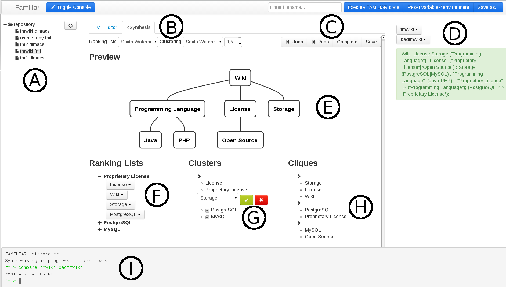


#### Run on the illustrative example

A video of WebFML in action is available [here](https://www.youtube.com/watch?v=JC6IinDqupg).


The first step to synthesize a Feature Model (FM) with WebFML is to load a formula or another artefact containing the configuration semantics of the FM. One way of loading a formula is to use the integrated FAMILIAR console and enter the following command: ``` myVar = FM("path/to/my/artefact") ```

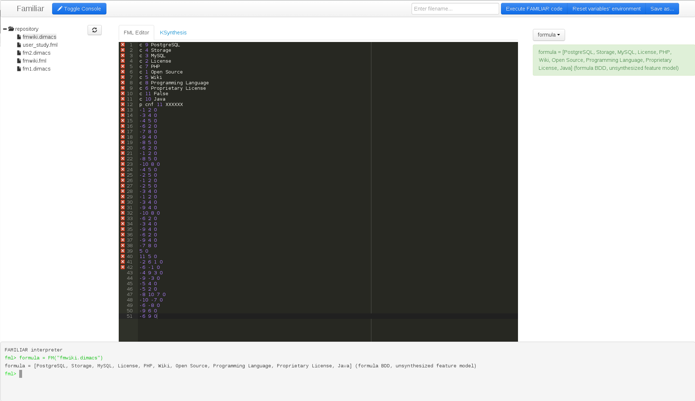

A new variable will be created on the right panel of WebFML. We can start the synthesis of the FM by clicking on the variable and then the __Synthesize__ button.

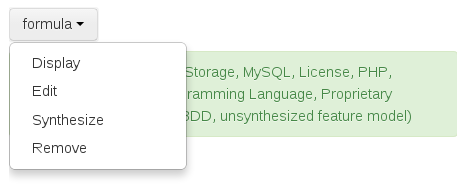

The next step consists in setting the parameters of the synthesis in the synthesis menu. For this example, we choose Levenshtein as the heuristic for parent candidates, Smith-Waterman as the clustering metric and we set the threshold at 0.6. After each change, the parent candidates lists and the clusters are updated.

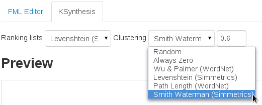

Our first action on the FM is to choose _Wiki_ as it root. For that, we go to the ranking list of the feature _Wiki_ and click on __Set as root__ button.
We note that WebFML allows to start the synthesis with any parent-child relation of the FM and do not require to set the root first.

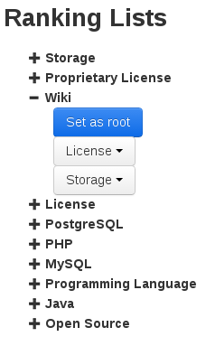

The preview of the FM is updated accordingly to our modifications.

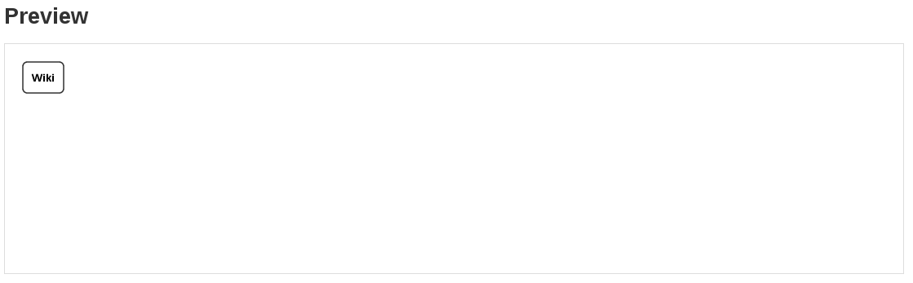

Then, we continue our synthesis by choosing a parent for the feature _Proprietary License_. We open the list of parent candidates for this feature and see that _License_ is the best parent according to our heuristic which seems correct.

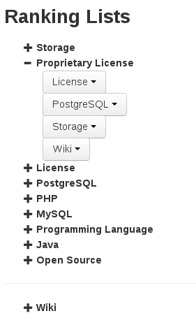

Thus, we click on _License_ and select the option __Select this parent__. 

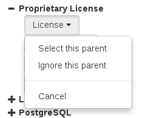

As a result, the features and their new relation appears on the FM overview.

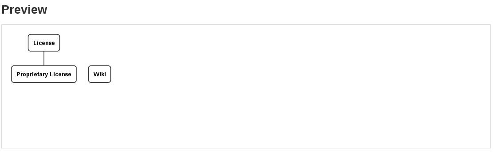

We continue our synthesis by clicking on the cluster _{PostgreSQL, MySQL}_. We know by experience that these features are two types of database and should be siblings. 

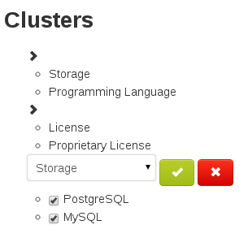

At this point, we can deselect some features that should not be part of this clusters. The list of common parent that appears above is automatically updated and we can choose the parent for this subcluster. In our case we keep all the features selected and we choose Storage as the parent. Once again, the FM is updated and as the two previous choices do not form a single tree, two trees are displayed side by side.

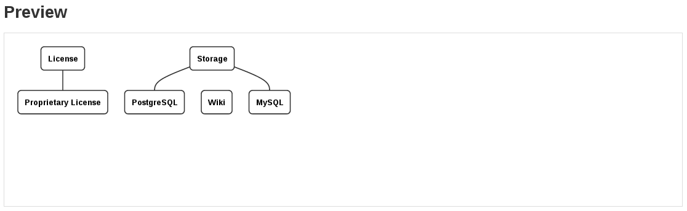

The other available operation on a cluster is to select its parent within the cluster's features. The same operation is available on cliques. We consider the clique _{Storage, License, Wiki, Hosting}_ and choose _Wiki_ as the parent of all the features of the clique.

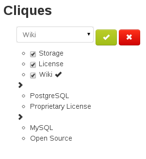

We confirm our choice and the FM is updated, resulting in a single tree.

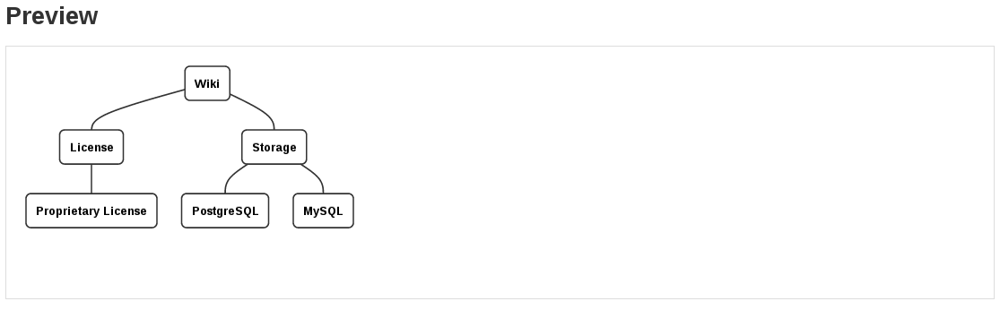

At this point of the synthesis, we start to recognize the hierarchy of the desired FM. Thus, we can try to generate the rest of the hierarchy by using the __Complete FM__ button in the top right corner of the synthesis tab of WebFML


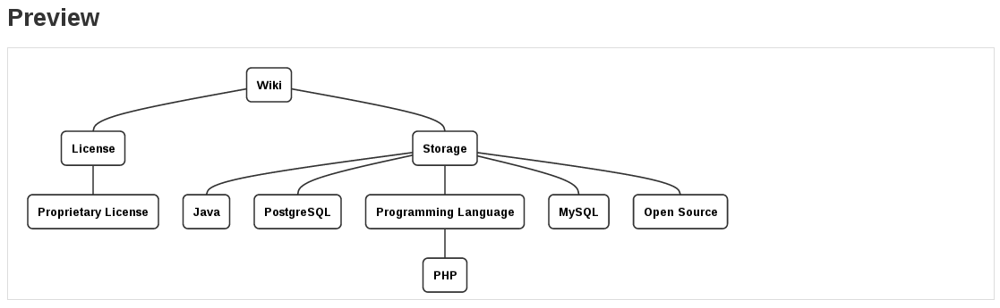

The result is not yet satisfactory. The heuristics we set at the beginning of the synthesis do not perform well on the other features. For example they propose _Programming Language_ as the child of _Storage_ instead of _Wiki_. 

In that case, we can change the heuristics and the clustering threshold to influence the automated synthesis or we can continue to provide information refactoring the generated FM. Here, we go to the ranking list of _Programming Language_. 

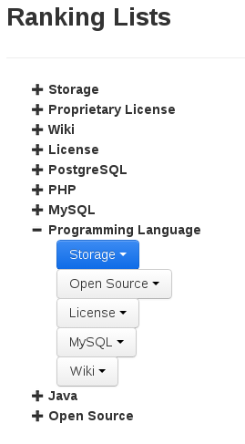

The current choice is highlighted in blue but WebFML allows to select the feature _Wiki_ as a new parent for _Programming Language_

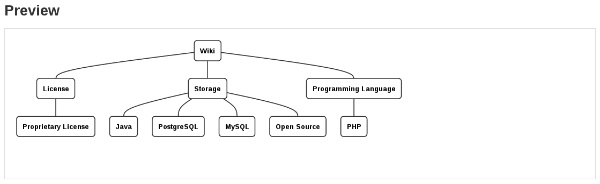

This example illustrates that synthesizing a FM is an iterative process. Moreover the order of the choices may differ from one user to another. We could adopt a top down approach by first defining the root and its descendants or a bottom up approach by first defining the leaves of the hierarchy and finally setting the root. We can also adopt an unordered approach like in our example.


#### Installation instructions 
* Install [Play! framework](http://www.playframework.com/)
* Download and extract [WebFML](TODO) __TODO : add link to archive of WebFML__
* Go to the extracted folder and start the server with *play run* command.
* Open your favorite web browser and go to [localhost:9000](http://localhost:9000)
* To use the heuristics based on [WordNet](http://wordnet.princeton.edu/), you need to install it on your machine and create a XML configuration file for [extJWNL](http://extjwnl.sourceforge.net/).
* To use the heuristics based on [Wikipedia Miner](http://wikipedia-miner.cms.waikato.ac.nz/), you need to create a Wikipedia database with their tool and link it to WebFML.


